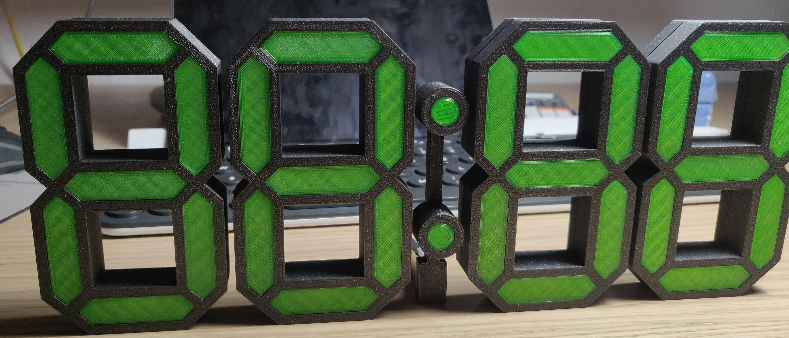

# 7 segment clock

This repository contains all the resources for the 7 segment clock I built.

The clock uses 6 digits to display the time (hours, minutes and seconds)

*6 digit photo coming*

Things to do:
- [ ] 3D model
- [ ] Program
- [ ] Documentation